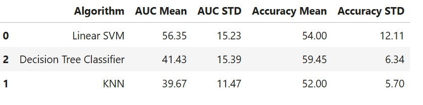
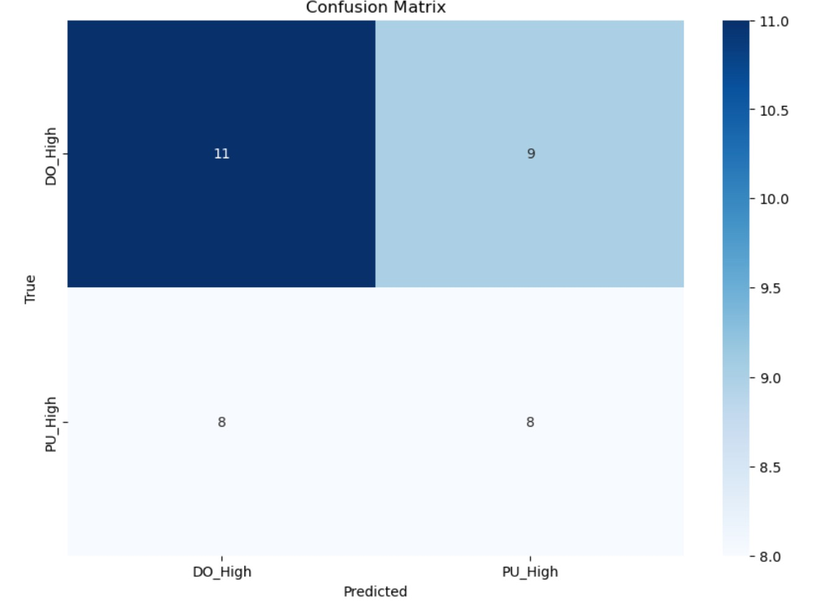
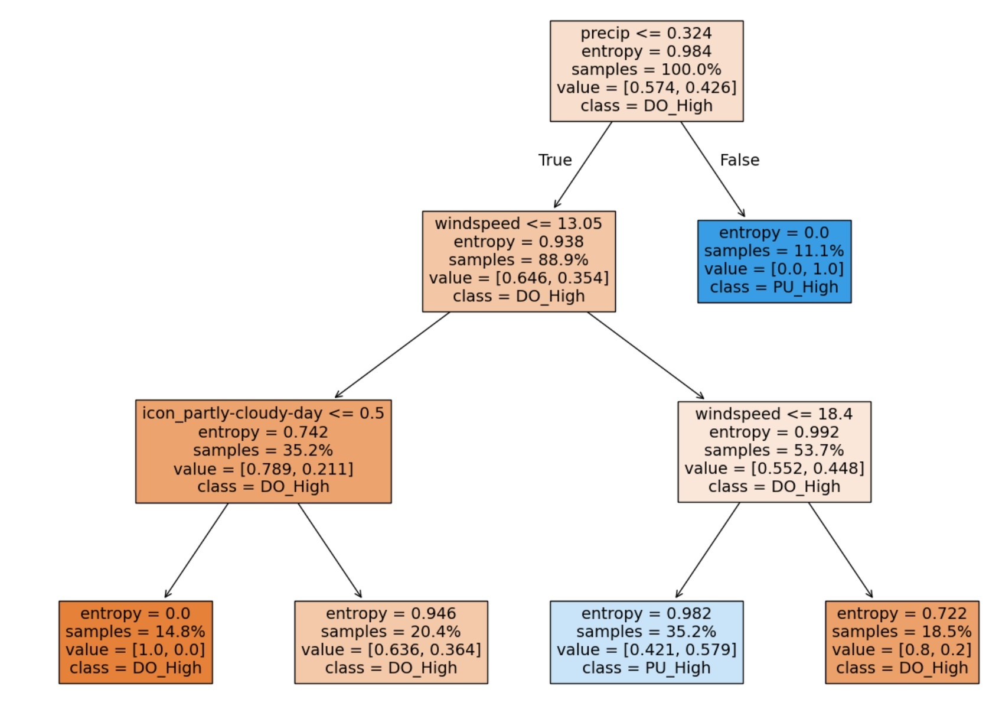

# Classification Tree and Performance Evaluation
The project analyzes Capital Bikeshare trip data from February, March, and April 2024, specifically focusing on the '22nd & H St NW' station. The notebook details reading and concatenating the data, and calculating the daily number of pickups and dropoffs at this station. Weather data from Visual Crossing is incorporated and merged with the bike data. The project aims to predict whether the number of pickups is greater than the number of dropoffs at the station, creating a categorical target variable for this purpose. The 'icon' weather feature is dummy encoded for modeling. A classification tree with a maximum depth of 3 is trained and visualized to predict the target variable. The performance of this classification tree is evaluated using accuracy and a confusion matrix on the test data. Additionally, the notebook compares the performance of Linear SVM, KNN (K=10), and the Decision Tree Classifier using AUC evaluated under 5-fold cross-validation to determine the best model. Finally, the out-of-sample performance of the best model (Linear SVM) is reported using AUC.

### Basic Information

* **Person or organization developing model**: N M Emran Hussain `nmemran.hussain@gwu.edu`
* **Model date**: March, 2025
* **Model version**: 1.0 
* **License**: [Apache License 2.0](https://github.com/nmemranhussain/RML_A_1_Group_11/blob/main/LICENSE)
* **Model implementation code**: [Assignment](https://github.com/nmemranhussain/6315_A_1/blob/main/6315_A_1_final.ipynb),
 
### Training Data

* Data dictionary: 

| Name | Modeling Role | Measurement Level| Description |
|------|---------------|------------------|-------------|
| Date	| Input	| Date	| Date of observation |
| Datetime |	Input	| Date	| Date of observation |
| Tempmax	| Input	|Interval	|Maximum daily temperature (°F) |
| Tempmin	| Input	| Interval	| Minimum daily temperature (°F) |
| Temp	| Input	| Interval	| Average temperature (°F) |
| Feelslikemax	| Input	| Interval	| Maximum feels-like temperature (°F) |
| Feelslikemin	| Input	| Interval	| Minimum feels-like temperature (°F) |
| Feelslike	| Input	| Interval	| Average feels-like temperature (°F) |
| Dew	| Input	| Interval	| Dew point temperature (°F) |
| Humidity	| Input	| Interval	| Humidity percentage |
| Precip	| Input	| Interval	| Total daily precipitation (inches) |
| Precipprob	| Input	 | Interval	| Probability of precipitation (%) |
| Precipcover	| Input	| Interval	| Proportion of the day with precipitation (0 to 1 scale) |
| Snow	| Input	| Interval	| Daily snowfall amount (inches) |
| Snowdepth	| Input	| Interval	| Snow depth on the ground at day's end (inches) |
| Windspeed	| Input	| Interval	| Wind speed (mph) |
| Winddir	| Input	| Interval	| Wind direction (degrees) |
| Sealevelpressure	| Input	| Interval	| Sea level pressure (hPa) |
| Cloudcover	| Input	| Interval	| Cloud cover (%) |
| Visibility	| Input	| Interval	| Visibility (miles) |
| Solarradiation	| Input	| Interval	| Solar radiation (W/m²) |
| Solarenergy	| Input	| Interval	| Solar energy (MJ/m²) |
| Uvindex	| Input	| Interval	| UV index |
| Moonphase	| Input	| Interval	| Moon phase (0=new, 1=full) |
| Icon	| Input	| Nominal	| Weather icon for the day |
| Which_High | Output | Categorical | Whether Pickups or Drop-offs are higher on a given day (PU_High or DO_High) |

- **Source of Taining Dataset Name:** Capital Bikeshare Data ('202402-capitalbikeshare-tripdata.csv', '202403-capitalbikeshare-tripdata.csv', '202404-capitalbikeshare-tripdata.csv' & 'DC_weather_2024.csv')  
- **Number of Samples:** 318689, 436947, 490266 & 367  
- **Features Used:** 'temp','precip','windspeed','uvindex'&'icon'
- **Target variable Used:** '**Which_high**' Whether Pickups or Drop-offs are higher on a given day (PU_High or DO_High)
- **Data Source:** [capitalbikeshare-data](https://s3.amazonaws.com/capitalbikeshare-data/index.html)
- **How training data was divided into training and test data**: 60% training, 40% test
- **Any differences in columns between training and test data**: None
- **Type of model**: Decision Tree, Linear SVM and KNN (K=10)
- **Software used to implement the model**: Python, scikit-learn
- **Version of the modeling software**: numpy: 2.0.2, pandas: 2.2.2, scikit-learn: 1.6.1, matplotlib: 3.10.0, seaborn: 0.13.2, Python 3.11.12

### Software Used to Implement the Model
- **Software:** Python (with libraries such as Pandas, Scikit-learn, seaborn & matplotlib)

### Version of the Modeling Software: 
- **'pandas'**: '2.2.2',
- **'scikit-learn'**: '1.4.2',
- **'seaborn'**: '0.13.2',
- **'matplotlib'**: '3.8.4**

### Evaluation Metrics  
- **Accuracy:** It Measures the proportion of correctly predicted labels (both PU_High and DO_High) out of all predictions. In this project, it indicates how well the classification tree model can distinguish days where pickups exceed drop-offs or vice versa based on weather features.
- **Confusion** A 2X2 table showing counts of true positives, true negatives, false positives, and false negatives. It is useful for understanding where the model misclassifies — e.g., how often it falsely predicts "PU_High" when it's actually "DO_High."
- **AUC Mean (Area Under the ROC Curve - Mean):** The average ability of the model to distinguish between the two classes (PU_High vs DO_High) across different cross-validation folds. A higher AUC (close to 1.0) means the model ranks positive examples (e.g., PU_High) higher than negative ones (DO_High) most of the time. It’s especially useful when classes are imbalanced.
- **AUC STD (Standard Deviation of AUC):** It measures how much the AUC score varies across different cross-validation runs. A low AUC STD indicates that the model performs consistently across subsets of the data, while a high STD suggests instability or sensitivity to certain data partitions.
- **Accuracy Mean:** The average percentage of correct predictions made by the model during cross-validation. If the model predicts correctly 85% of the time across 5 folds, the accuracy mean is 0.85. It reflects overall model performance.
- **Accuracy STD (Standard Deviation of Accuracy):** The variability in the model’s accuracy across different folds. A small standard deviation means your model generalizes well; a large one suggests it may perform well on some splits and poorly on others.

### Quantitative Analysis

 
Figure 1. Comparison of the Decision Tree, Linear SVM and KNN (K=10) methods by AUC evaluated under 5-fold cross-validation.

Figure 2. Confusion matrix of this classification tree in the test data

Figure 3. Visualization of a classification tree with **max_depth=3** for predicting '**Which_High**' using '**entropy**' as the criterion.

